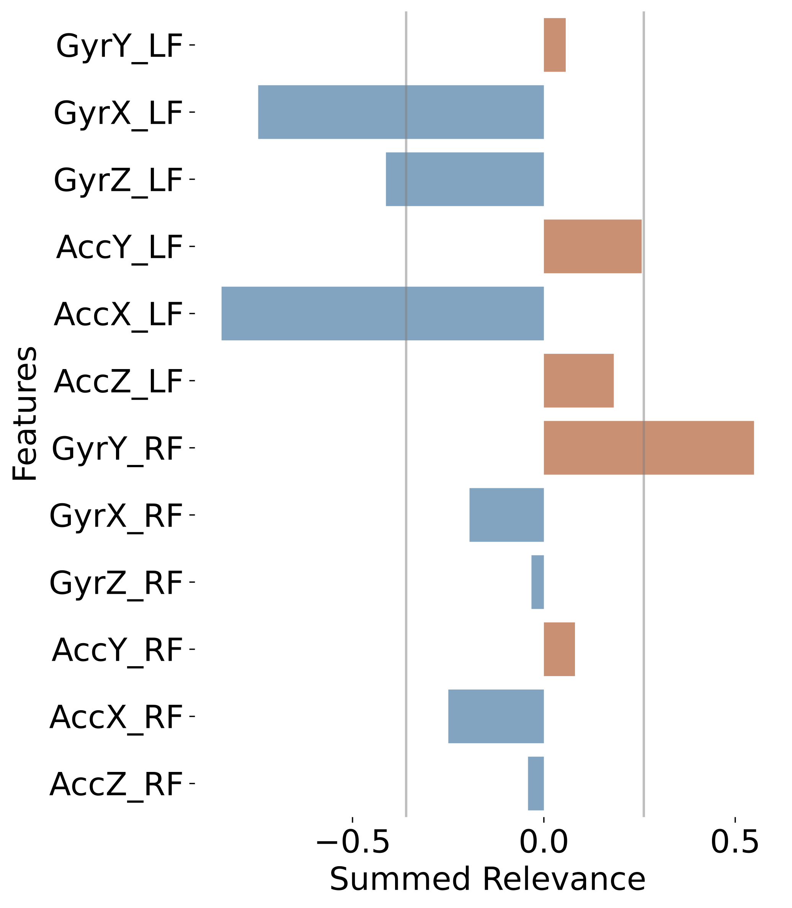
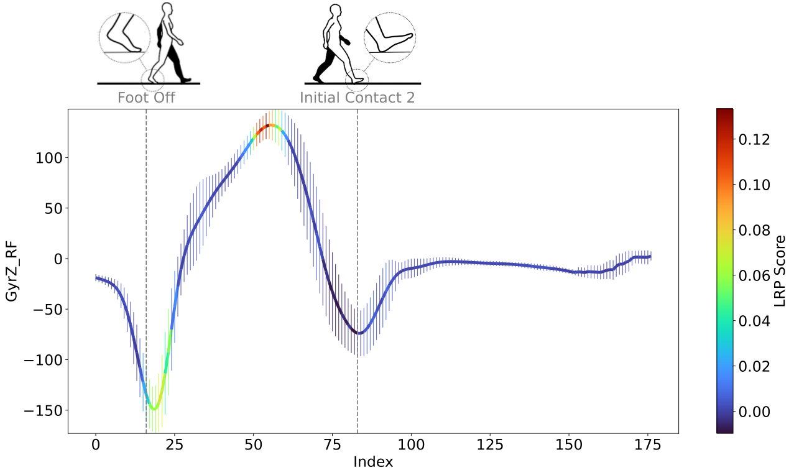

# Transparent Neural Networks for Gait Analysis

Repo to analyze time series data with Convolutional Neural Network (CNN) and use explainable AI methods to visualize feature importance. The methods are based on this publication:\
Zhou, Lin, Eric Fischer, Clemens Markus Brahms, Urs Granacher, and Bert Arnrich. "Using transparent neural networks and wearable inertial sensors to generate physiologically-relevant insights for gait." In 2022 21st IEEE International Conference on Machine Learning and Applications (ICMLA), pp. 1274-1280. IEEE, 2022.

Following updates were made scince the original publication:
* Added an option to re-sample all stride windows to 200 samples, instead of padding to the length of the longest window.
* Added one step to re-train the model with the best hyperparameters on all the train and validation samples before final testing.
* Added an option to dynamically segment the raw IMU data using foot on the paretic side (the affected side from stroke), instead of fixed left or right side.

## Functionality
The methods in this repository 
* Ingests raw data from wearables (IMU) collected during walking activity,
* uses 1D CNN to classify them under different walking conditions, then 
* uses explainable AI methods (LRP for transparent neural netowrks) to visualize feature importance in the time series data.

## Example Results
Overall feature importance for all sensor data modalities (e.g., acceleration X axis) and feature importance in the input time series data of one modality.
<p align="center">   </p>

## Getting Started
These instructions will get you a copy of the project up and running on your local machine for development and testing purposes.

### Getting the Project
```bash
git clone https://github.com/Linn39/gait_cnn.git
```

### Setting up the Environment
Once you have the project on your local machine, you can set up the Conda environment using the `requirements.txt` file. Alternatively, the `environment.yml` can also be used to set up the environment.
```bash
conda create --name myenv --file requirements.txt python=3.11
conda activate myenv
```

Replace `myenv` with the name you want to give to your environment.

Alternatively, you can use pip to install the project requirements.

### Getting the data
The following datasets were used to create this repository  
* [DUO-GAIT](https://zenodo.org/records/8244887) dataset.
* [STROKE-GAIT](https://zenodo.org/records/10534055) dataset.

Save data to ```./data```, or to another location you prefer. Then create a `path.json` file to save the absolute path to the data.

Methods in this repository can be used for explainable AI for general time series data.

### Classification
run ```src/main_classification_cv.py```

### Model interpretation & visualization
run ```src/main_innvestigate.py```

## Project contributers
* Lin Zhou
* Eric Fischer


Project Organization
------------

    ├── LICENSE
    ├── Makefile           <- Makefile with commands like `make data` or `make train`
    ├── README.md          <- The top-level README for developers using this project.
    ├── data
    │   ├── external       <- Data from third party sources.
    │   ├── interim        <- Intermediate data that has been transformed.
    │   ├── processed      <- The final, canonical data sets for modeling.
    │   └── raw            <- The original, immutable data dump.
    │
    ├── docs               <- A default Sphinx project; see sphinx-doc.org for details
    │
    ├── models             <- Trained and serialized models, model predictions, or model summaries
    │
    ├── notebooks          <- Jupyter notebooks. Naming convention is a number (for ordering),
    │                         the creator's initials, and a short `-` delimited description, e.g.
    │                         `1.0-jqp-initial-data-exploration`.
    │
    ├── references         <- Data dictionaries, manuals, and all other explanatory materials.
    │
    ├── reports            <- Generated analysis as HTML, PDF, LaTeX, etc.
    │   └── figures        <- Generated graphics and figures to be used in reporting
    │
    ├── requirements.txt   <- The requirements file for reproducing the analysis environment, e.g.
    │                         generated with `pip freeze > requirements.txt`
    │
    ├── setup.py           <- makes project pip installable (pip install -e .) so src can be imported
    ├── src                <- Source code for use in this project.
    │   ├── __init__.py    <- Makes src a Python module
    │   │
    │   ├── data           <- Scripts to download or generate data
    │   │   └── make_dataset.py
    │   │
    │   ├── features       <- Scripts to turn raw data into features for modeling
    │   │   └── build_features.py
    │   │
    │   ├── models         <- Scripts to train models and then use trained models to make
    │   │   │                 predictions
    │   │   ├── predict_model.py
    │   │   └── train_model.py
    │   │
    │   └── visualization  <- Scripts to create exploratory and results oriented visualizations
    │       └── visualize.py
    │
    └── tox.ini            <- tox file with settings for running tox; see tox.readthedocs.io


--------

<p><small>Project based on the <a target="_blank" href="https://drivendata.github.io/cookiecutter-data-science/">cookiecutter data science project template</a>. #cookiecutterdatascience</small></p>
